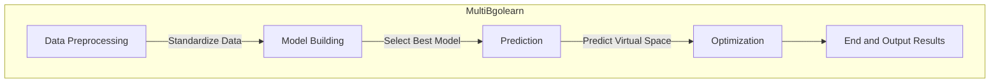
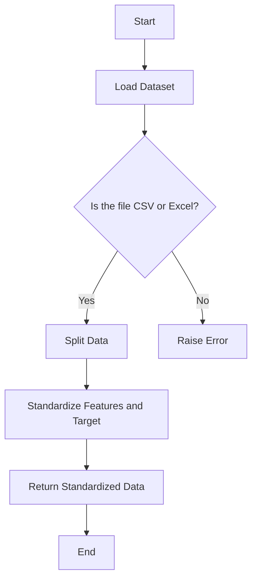
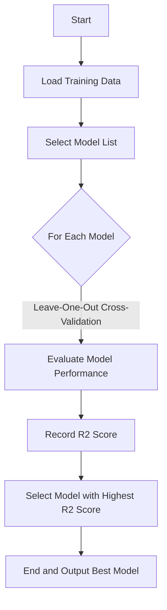
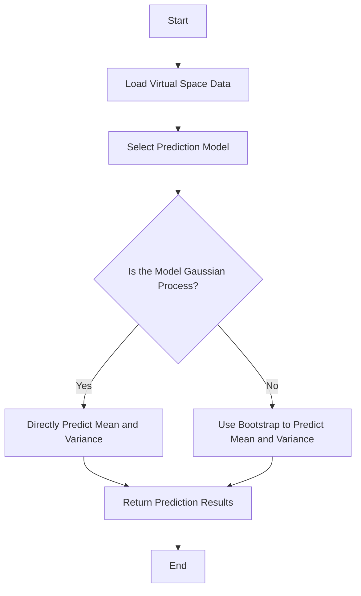
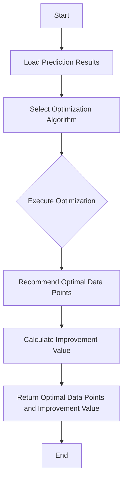
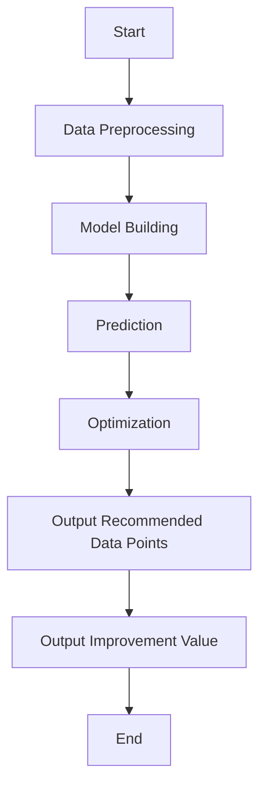

# MultiBgolearn: Multi-Objective Bayesian Global Optimization for Materials Design
[HomePage](http://bgolearn.caobin.asia/) 
[](./LICENSE)
[](https://www.python.org/downloads/)
[](https://github.com/Bin-Cao/MultiBgolearn/issues)


**Note:** Sometimes, the installation of a dependent package, `pygmo`, may fail when using `pip`. To resolve this issue, it is recommended to install `pygmo` via `conda` by running the following command:

```bash
conda install -c conda-forge pygmo
```


## Overview

**MultiBgolearn** is a Python package designed for multi-objective Bayesian global optimization (MOBO), specifically tailored for materials design. It extends the functionalities of the **Bgolearn** package, which focuses on single-objective optimization, by enabling the simultaneous optimization of multiple material properties. This makes **MultiBgolearn** highly suitable for real-world applications where trade-offs between competing objectives are common.

The repository provides the source code of the **MultiBgolearn** package along with several multi-objective Bayesian global optimization (MOBO) algorithms.

## Features

- Implements multiple MOBO algorithms such as **Expected Hypervolume Improvement (EHVI)**, **Probability of Improvement (PI)**, and **Upper Confidence Bound (UCB)**.
- Supports the optimization of multiple objectives simultaneously, making it ideal for materials with competing property targets.
- Flexible surrogate model selection, allowing the user to choose from a range of models such as RandomForest, GradientBoosting, SVR, GaussianProcess, and more.
- Automatic or user-defined selection of surrogate models for optimization.
- Bootstrap iterations for uncertainty quantification in model predictions.

## Installation

To install **MultiBgolearn**, clone the repository and install the dependencies:

```bash
pip install MultiBgolearn
```

## Usage

The **MultiBgolearn** package is designed for ease of use in materials design projects. Below is an example of how to use it:

### Example

```python
from MultiBgolearn import bgo

# Define your dataset and virtual space paths
dataset_path = './data/dataset.csv'
VSdataset = 'virtual_sample.xlsx'

# Set the number of objectives (e.g., 3 for three-objective optimization)
object_num = 3

# Apply Multi-Objective Bayesian Global Optimization
VS_recommended, improvements, index = bgo.fit(dataset_path, VSdataset, object_num, 
                                                        max_search=True, method='EHVI', 
                                                        assign_model='GaussianProcess', 
                                                        bootstrap=5)
```

### Parameters

- **dataset** (`str`): The path to the dataset containing both features and response variables.
- **VSdataset** (`str`): The path to the virtual space where candidate data for optimization is stored.
- **object_num** (`int`): The number of objectives (target properties) to optimize.
- **max_search** (`bool`, optional, default=`True`): Whether to maximize (`True`) or minimize (`False`) the objectives.
- **method** (`str`, optional, default=`EHVI`): The optimization method. Supported methods:
  - `'EHVI'`: Expected Hypervolume Improvement
  - `'PI'`: Probability of Improvement
  - `'UCB'`: Upper Confidence Bound
- **assign_model** (`bool` or `str`, optional, default=`False`): Specify the surrogate model:
  - `'RandomForest'`
  - `'GradientBoosting'`
  - `'LinearRegression'`
  - `'Lasso'`
  - `'Ridge'`
  - `'SVR'`
  - `'GaussianProcess'`
  - `False`: The surrogate model is chosen automatically.
- **bootstrap** (`int`, optional, default=`5`): Number of bootstrap iterations for uncertainty quantification.

### Return

The `fit` method returns a tuple:
- **VS[res_index]**: The recommended data point from the virtual space.
- **improvements**: The calculated improvements based on the chosen optimization method.
- **res_index**: The index of the recommended data point in the virtual space.

### Notes
The selected method will influence how the algorithm balances different objectives during optimization.

## Algorithms

**MultiBgolearn** includes several optimization strategies, including:

1. **Expected Hypervolume Improvement (EHVI)**: Focuses on maximizing the volume of the objective space dominated by the solutions.
2. **Probability of Improvement (PI)**: Selects points with the highest probability of improving over the best known solution.
3. **Upper Confidence Bound (UCB)**: Explores points with the highest upper confidence bound, balancing exploration and exploitation.

## Contributions

We welcome contributions from the community! Please feel free to open issues or submit pull requests. 

- Issues: [GitHub Issues](https://github.com/Bin-Cao/MultiBgolearn/issues)
- Pull Requests: [GitHub Pull Requests](https://github.com/Bin-Cao/MultiBgolearn/pulls)

For questions or suggestions, feel free to contact:

- Bin Cao: [bcao686@connect.hkust-gz.edu.cn](mailto:bcao686@connect.hkust-gz.edu.cn)
- GitHub: [https://github.com/Bin-Cao/MultiBgolearn](https://github.com/Bin-Cao/MultiBgolearn)

## License

This project is licensed under the MIT License. See the [LICENSE](./LICENSE) file for more details.


## Architecture

The system architecture diagram shows the key modules of the MultiBgolearn algorithm and their connections.



## Data Preprocessing Flowchart

The data preprocessing flowchart outlines the steps involved in the data preprocessing module.



## Model Building Flowchart

The model building flowchart illustrates how to construct and select the optimal surrogate model.



## Prediction Flowchart

The prediction flowchart details the process of predicting the virtual space data using the selected model.



## Optimization Flowchart

The optimization flowchart demonstrates how to apply the multi-objective Bayesian global optimization algorithm to recommend the optimal data points.



## Logic Flowchart

The logic flowchart illustrates the overall logic flow of the MultiBgolearn algorithm.



