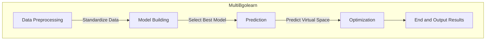
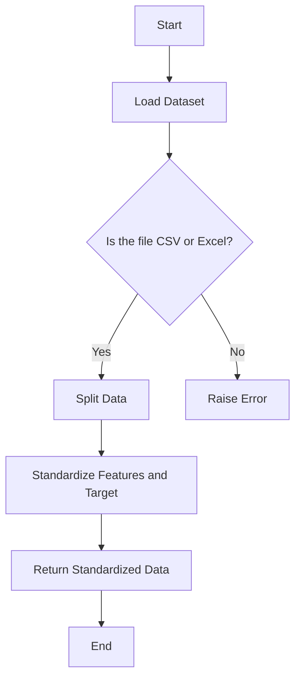
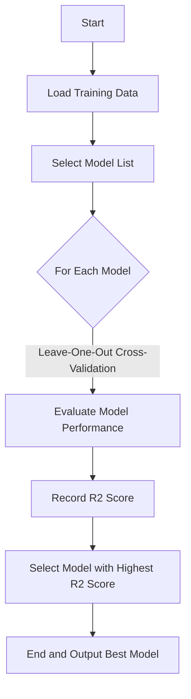
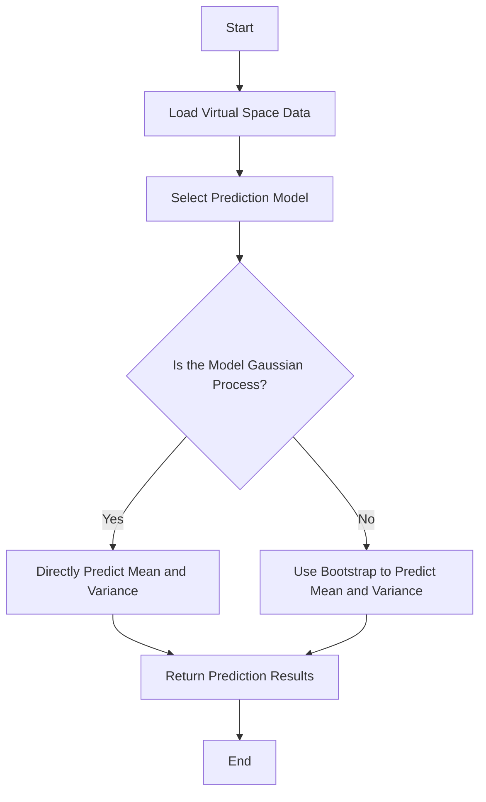
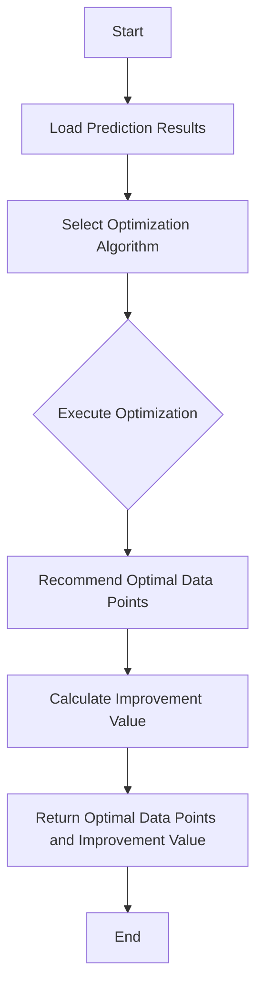
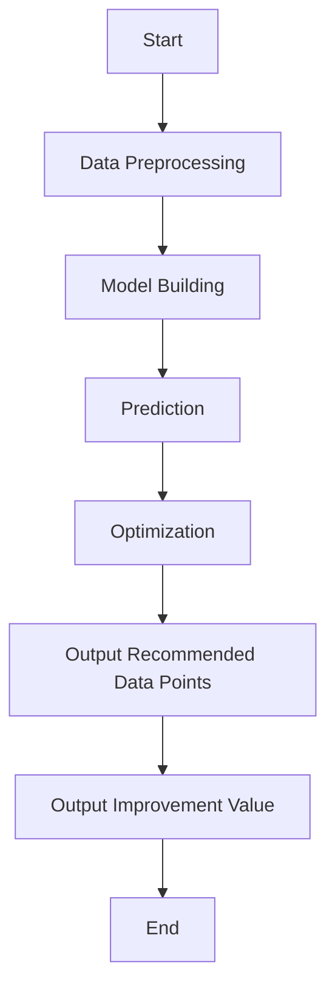
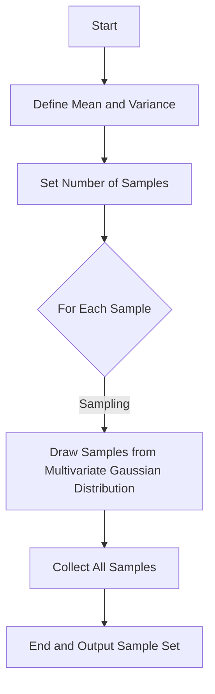
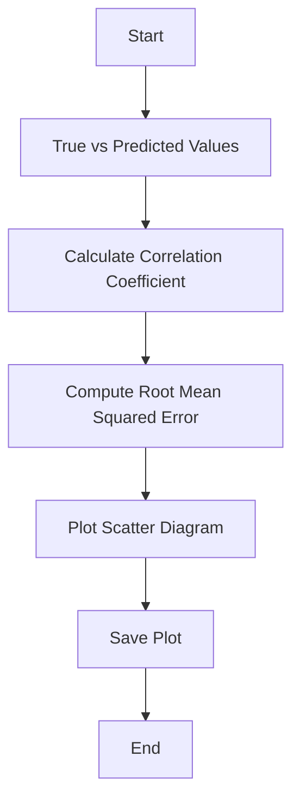

source code : [huggingface](https://huggingface.co/caobin/MultiBgolearn/tree/main)

# Structure and Flowcharts

This section provides a detailed overview of the MultiBgolearn algorithm's structure and workflow, using various diagrams to illustrate the different components and their relationships.

## System Architecture Diagram

The system architecture diagram shows the key modules of the MultiBgolearn algorithm and their connections.

## Data Preprocessing Flowchart

The data preprocessing flowchart outlines the steps involved in the data preprocessing module.

## Model Building Flowchart

The model building flowchart illustrates how to construct and select the optimal surrogate model.

## Prediction Flowchart

The prediction flowchart details the process of predicting the virtual space data using the selected model.

## Optimization Flowchart

The optimization flowchart demonstrates how to apply the multi-objective Bayesian global optimization algorithm to recommend the optimal data points.

## Logic Flowchart

The logic flowchart illustrates the overall logic flow of the MultiBgolearn algorithm.

## Monte Carlo Simulation Flowchart

The Monte Carlo simulation flowchart describes how to perform sampling using the Monte Carlo method.

## Performance Evaluation Flowchart

The performance evaluation flowchart shows how to assess the predictive performance of the model.

